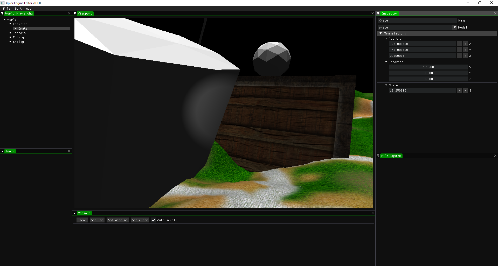

# Xplor Engine

A specialized OpenGL game engine made to create open-world games in C++.

Was working on this for a few months, but it will probably remain unfinished. Putting it on here if anyone else wants to learn from the code.

Third-Party Libraries:

- SDL2 (https://www.libsdl.org/)
- ASSIMP (https://www.assimp.org/)
- GLAD (https://github.com/Dav1dde/glad)
- GLM (https://github.com/g-truc/glm)
- SimpleJSON (https://github.com/nbsdx/SimpleJSON)
- Robin Hood Hashing (https://github.com/martinus/robin-hood-hashing)
- stb_image (https://github.com/nothings/stb)

Version 0.1
